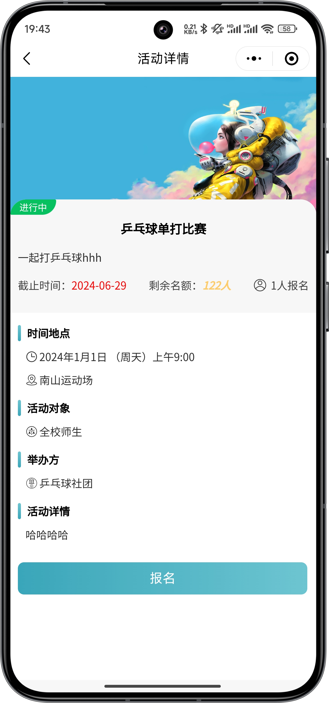

# 社团小程序 社团管理系统（个人独立编写，不是网上资源）
## 一、介绍（获取源码，[查看文章末尾](#四-咨询我们)） 
计算机毕业设计 社团小程序 社团管理系统，前后端分离，分为三个角色：系统管理员，社团管理员和用户
 有登录，参加社团，参加活动，论坛，社团管理，用户管理，活动管理，动态管理等功能

## 二、技术栈
1. 前端：vue框架，微信原生小程序
2. 后端：nodejs express框架
3. 数据库：mysql

## 三、效果展示  
### 1. 用户端（小程序）

### 2. 后台管理（管理端）

## 四、🚀 咨询我们
1. **个人手敲，独立编写项目，不是网上所找的资源**
2. 提示该项目需要付费获取，编码不易，有需要或者疑问可加微信号：rolling_257
3. 扫一扫加我微信好友吧，请备注 社团小程序源码获取

